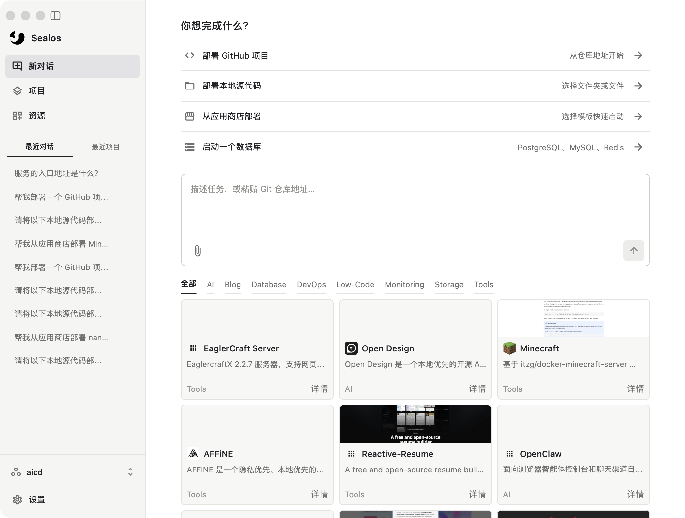
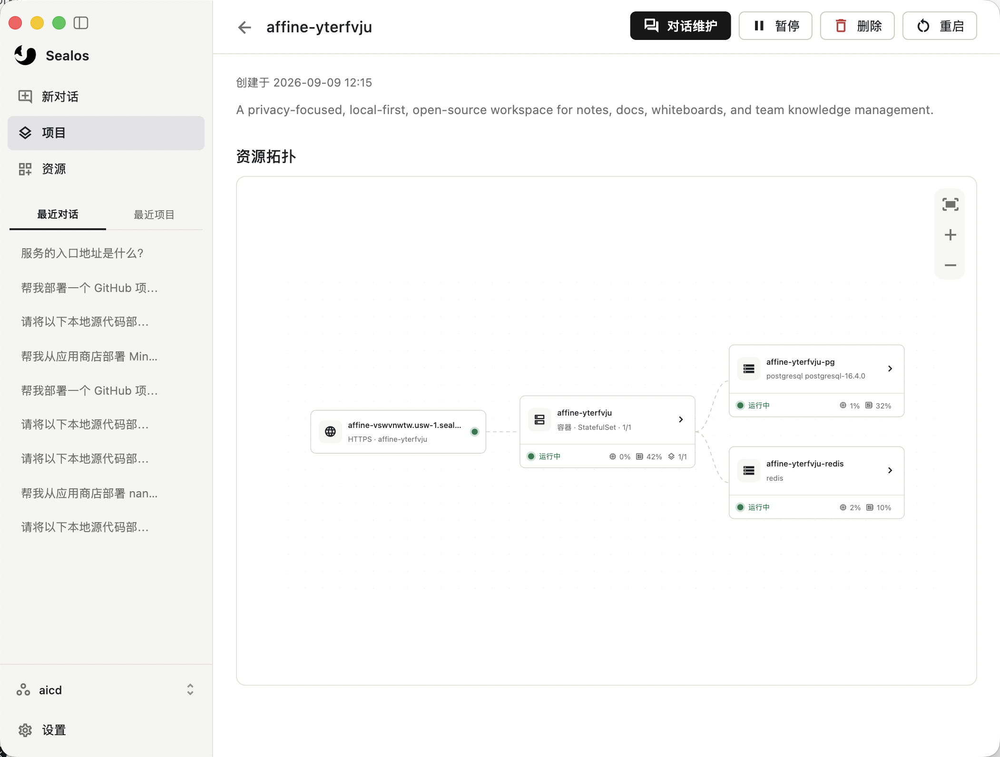
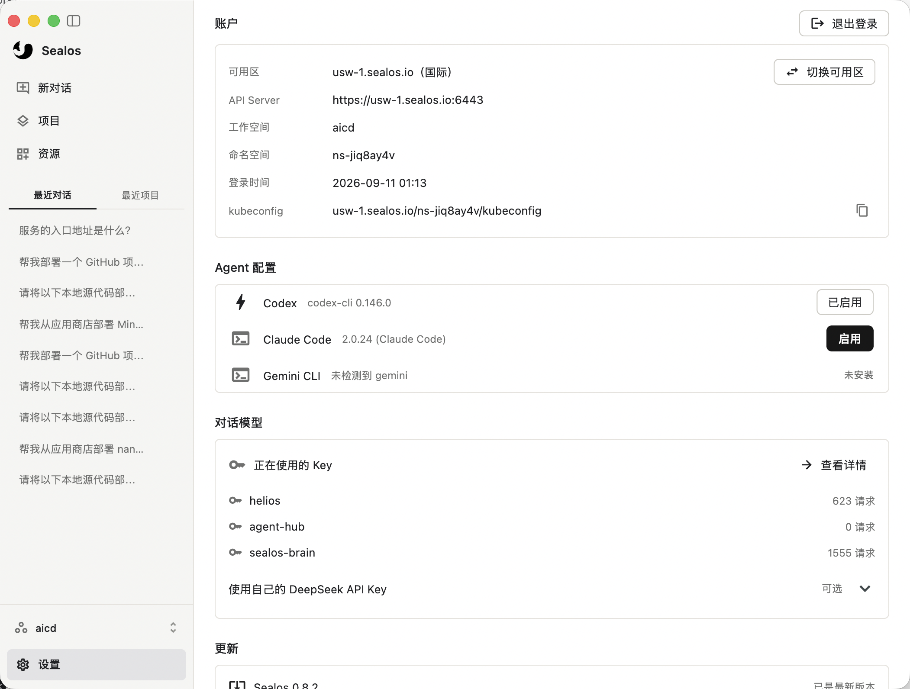

# Sealos Desktop

### 从一句需求，到一个上线的应用。

**把部署交给 AI，把时间留给产品。** Sealos Desktop 把 AI Agent 和云资源管理放进同一个桌面应用：描述需求、粘贴 GitHub 仓库地址，或选择本地代码，让 Agent 协助完成部署；上线后，继续通过对话排查问题、维护应用，通过可视化界面掌握资源状态。

从第一次部署，到日常维护，都在这里完成。

**[下载体验 →](https://github.com/sealos-apps/sealos/releases/latest)** · [快速开始](#快速开始) · [反馈问题](https://github.com/sealos-apps/sealos/issues)

支持 **macOS Apple Silicon / Intel** 和 **Windows x64**。

## 说出你想做的，开始部署

有一个想上线的项目，不必先把部署流程研究一遍。你可以从 GitHub 仓库、本地源码或应用商店模板开始，也可以直接描述需求，让 Agent 帮你分析项目、准备部署，并检查运行情况。

> 帮我部署这个 GitHub 项目，并配置它需要的 PostgreSQL 数据库。
>
> 把这个本地项目部署到 Sealos，完成后告诉我访问地址。
>
> 帮我从应用商店部署 AFFiNE。

首页把常用入口放在一起：部署代码、选择模板、启动数据库。无论是验证一个想法，还是搭建自己的工具，都有一个清晰的起点。



## 应用上线之后，也有人帮你照看

一个项目往往包含应用、数据库和访问入口。Sealos 用资源拓扑把它们连接起来，让你直接看到依赖关系、运行状态和资源使用情况，再进入具体资源查看详情。

需要暂停、重启时，直接点击按钮；需要分析问题、调整配置时，打开**对话维护**，围绕当前项目继续沟通。

> 这个应用为什么启动失败？帮我检查日志和数据库连接。
>
> 我想调整这个容器的环境变量，先帮我确认当前配置。

**从发现问题到开始处理，不用重新交代项目背景。** 容器和数据库详情都能进入关联的维护对话，让资源与上下文留在一起。



## 数据库、文件存储，也在同一个工作台

部署只是开始。查看数据、管理文件、检查网络与日志，这些日常工作也能直接在 Sealos Desktop 中完成。

| 你想完成的事 | Sealos Desktop 提供的能力 |
| --- | --- |
| 看清应用的运行情况 | 查看容器状态、资源用量、内外网地址、环境变量和日志 |
| 查看数据库里的数据 | 浏览数据库与表，使用可关闭的多表标签页、分页和基础筛选查看数据 |
| 用自然语言探索数据 | 从数据页面打开「问数」，带上当前数据库和表的上下文与 Agent 对话 |
| 管理应用使用的文件 | 浏览 Bucket、目录与文件，上传、下载、删除文件，切换公开或私有访问策略 |
| 把对象存储接入自己的程序 | 获取 S3 兼容访问所需的 Access Key、Secret 和服务地址 |
| 管理不同环境 | 切换可用区与工作空间，按环境保存 Kubeconfig |

数据库浏览通过集群内网访问，**无需为了查看数据而开启数据库公网访问**。

## 用你熟悉的 Agent，管理你的云资源

Sealos Desktop 支持接入本机的 **Codex、Claude Code 和 Gemini CLI**，在账户设置中检测并启用已安装的 Agent。你可以把熟悉的 AI 工作方式，延伸到应用部署和云资源维护。

账户页集中展示当前可用区、工作空间、Kubeconfig 和 Agent 状态。切换环境、确认当前使用的工具，都有明确的入口。



## 快速开始

1. **[下载最新版本](https://github.com/sealos-apps/sealos/releases/latest)**。Mac 按芯片类型选择 `mac-arm64.dmg` 或 `mac-x64.dmg`；Windows 选择 `windows-x64.exe`。
2. **登录 Sealos 账户**，选择要使用的可用区和工作空间。
3. **准备对话工具**。如需使用本机 Agent，请先安装并完成对应 CLI 的登录或授权，再到「设置 → Agent 配置」中启用。
4. **开始第一个任务**。粘贴仓库地址、选择本地项目，或从应用商店挑一个想用的应用。

安装包已包含桌面后端、Eve 和 Node.js 运行时。源码构建按项目需要使用本机的 Docker、kubectl 等工具；云资源与 AI 服务使用对应账户的额度。

**试试从这句话开始：**

> 帮我部署一个我自己的应用，先看看这个仓库需要哪些运行环境和数据库：`<你的 GitHub 仓库地址>`

## 参与开发

桌面界面使用 Flutter，支持 macOS 和 Windows；本地 Node.js 后端负责 Sealos、Kubernetes 与 Agent 集成。

准备 Node.js 24、Flutter 及对应平台的桌面构建工具后，在仓库根目录执行：

```bash
npm install
npm run build:backend
npm run dev
```

常用检查与打包命令：

```bash
npm run typecheck          # TypeScript 类型检查
npm run typecheck:flutter  # Flutter 静态分析
npm run test:desktop       # 桌面端与后端测试
npm run build:mac          # 在 macOS 上构建 DMG
npm run build:win          # 在 Windows 上构建安装程序
```

详见 [桌面架构与开发指南](docs/desktop.md) · [版本发布指南](docs/releases.md)。

遇到问题或有想法，欢迎 [提交 Issue](https://github.com/sealos-apps/sealos/issues) 或贡献 Pull Request。请附上系统版本、应用版本和复现步骤，帮助我们更快定位问题。
